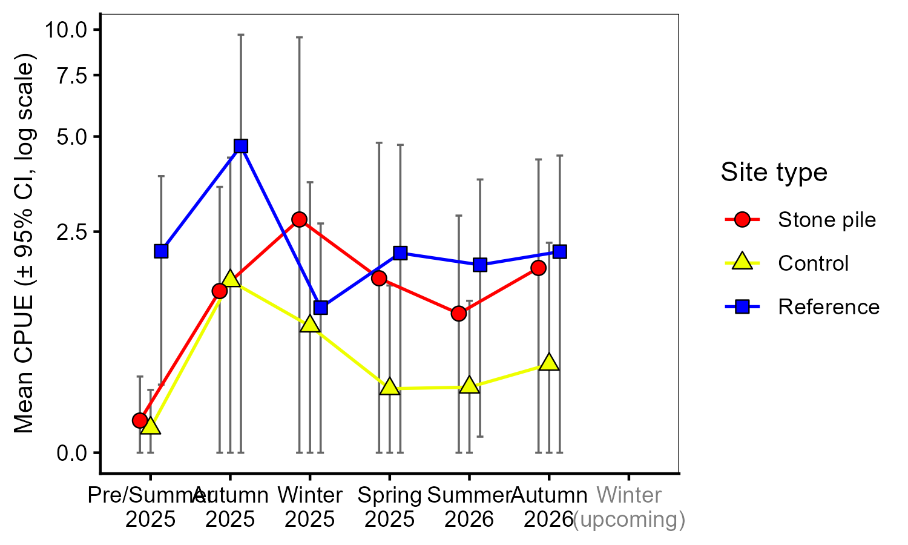
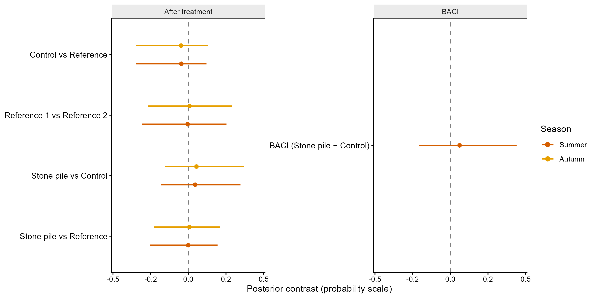
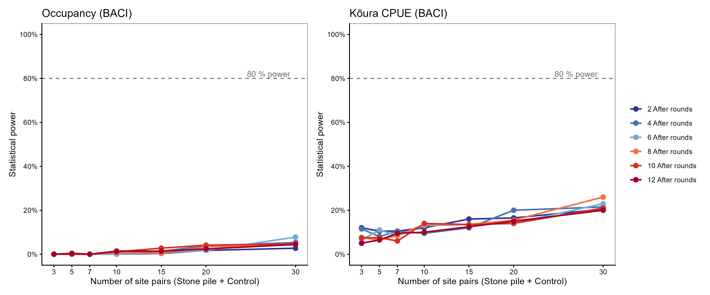

```{=latex}
\clearpage
\providecommand{\chaptermark}[1]{}
\ifcsname c@chapter\endcsname
\setcounter{chapter}{5}
\setcounter{section}{0}
\addcontentsline{toc}{chapter}{\protect\numberline{5}Rock Piles as K\={o}ura Habitat}
\chaptermark{Rock Piles as K\={o}ura Habitat}
\fi
\providecommand{\thechapter}{5}
\thispagestyle{empty}
\begin{tikzpicture}[remember picture, overlay]
  \begin{scope}
    \clip ([yshift=-7cm]current page.north west)
          rectangle ([yshift=4.5cm]current page.south east);
    \node[inner sep=0pt, anchor=north]
      at ([yshift=-7cm]current page.north)
      {\includegraphics[height=18.2cm]{images/ch5_cover.jpg}};
  \end{scope}
  \fill[black]
    (current page.north west) rectangle ([yshift=-7cm]current page.north east);
  \node[color=thesissand, align=left,
        font=\fontsize{13}{16}\selectfont\sffamily, anchor=west]
    at ([xshift=1.5cm, yshift=-1.5cm]current page.north west)
    {Chapter \thechapter};
  \node[color=white, text width=0.85\paperwidth, align=left,
        font=\fontsize{22}{28}\selectfont\bfseries\sffamily, anchor=west]
    at ([xshift=1.5cm, yshift=-4cm]current page.north west)
    {Rock Piles as K\={o}ura Habitat};
  \node[color=white, text width=0.85\paperwidth, align=left,
        font=\fontsize{10}{13}\selectfont\itshape\sffamily, anchor=north west]
    at ([xshift=1.5cm, yshift=-5.0cm]current page.north west)
    {Reinforcing k\={o}ura resilience using rock piles to enhance freshwater crayfish habitat in an Aotearoa New Zealand lake};
  \fill[black]
    (current page.south west) rectangle ([yshift=4.5cm]current page.south east);
  \node[color=white, text width=0.85\paperwidth, align=left,
        font=\fontsize{9}{13}\selectfont\sffamily, anchor=west]
    at ([xshift=1.5cm, yshift=3.2cm]current page.south west)
    {Olivier V.\ Raven, Ian A.\ K.\ Kusabs, Robin Holmes, Francis J.\ Burdon \& Deniz Özkundakci};
  \node[color=thesissand, text width=0.85\paperwidth, align=left,
        font=\fontsize{9}{13}\selectfont\itshape\sffamily, anchor=west]
    at ([xshift=1.5cm, yshift=1.5cm]current page.south west)
    {Freshwater Biology --- In preparation};
\end{tikzpicture}
\null
\clearpage
```

::: {.content-visible when-format="docx"}
Chapter 5 Rock Piles as Kōura Habitat
Reinforcing kōura resilience using rock piles to enhance freshwater crayfish habitat in an Aotearoa New Zealand lake

{fig-align="center" width=15cm}

Olivier V. Raven, Ian A. K. Kusabs, Robin Holmes, Francis J. Burdon & Deniz Özkundakci

*Freshwater Biology* — In preparation


:::

::: {.content-visible when-format="html"}
# Chapter 5 Rock Piles as Kōura Habitat {.unnumbered}
:::

```{r}
#| label: start-ch5
#| include: false

chapter_dir <- normalizePath(file.path(dirname(knitr::current_input(dir = TRUE)), "05_stone_piles_rotoiti"))
if (!dir.exists(chapter_dir)) chapter_dir <- normalizePath(dirname(knitr::current_input(dir = TRUE)))
fig_labels <- c("fig-koura-trends", "fig-convergence-plot", "fig-forest-plot",
                 "fig-length-weight", "fig-descriptive-context")
out_dir <- file.path(chapter_dir, "outputs")
dir.create(out_dir, showWarnings = FALSE, recursive = TRUE)

parent_knit_env <- knitr::knit_global()

qmd_lines <- readLines(file.path(chapter_dir, "analysis.qmd"), warn = FALSE)
in_r_chunk <- FALSE
r_lines <- character(0)
for (ln in qmd_lines) {
  if (grepl("^```\\{[rR]", ln)) { in_r_chunk <- TRUE; next }
  if (grepl("^```", ln) && in_r_chunk) { in_r_chunk <- FALSE; next }
  if (in_r_chunk) r_lines <- c(r_lines, ln)
}
r_lines <- c(
  paste0(".chwd <- setwd(", deparse(chapter_dir), ")"),
  r_lines,
  "setwd(.chwd)", "rm(.chwd)"
)
tmp_r <- file.path(chapter_dir, ".analysis_tmp.R")
writeLines(r_lines, tmp_r)
eval(parse(file = tmp_r, encoding = "UTF-8"))
unlink(tmp_r)
out_dir <- file.path(chapter_dir, "outputs")

if (!all(file.exists(file.path(out_dir, paste0(fig_labels, ".png"))))) {
  .old_wd <- setwd(chapter_dir)
  knitr::knit(file.path(chapter_dir, "analysis.qmd"), output = tempfile(), quiet = TRUE, envir = parent_knit_env)
  setwd(.old_wd)
  for (lbl in fig_labels) {
    src <- knitr::fig_chunk(lbl, "png")
    if (file.exists(src)) file.copy(src, file.path(out_dir, paste0(lbl, ".png")), overwrite = TRUE)
  }
}
input_dir <- normalizePath(dirname(knitr::current_input(dir = TRUE)))
if (input_dir != chapter_dir) {
  thesis_out <- file.path(input_dir, "outputs")
  dir.create(thesis_out, showWarnings = FALSE, recursive = TRUE)
  file.copy(list.files(out_dir, full.names = TRUE, pattern = "\\.(png|jpg)$"), thesis_out, overwrite = TRUE)
}
knitr::opts_knit$set(root.dir = chapter_dir)

ps  <- readr::read_csv(file.path(chapter_dir, "outputs", "tbl-power-scalars.csv"),
                       show_col_types = FALSE)
pwr <- function(key) ps$value[ps$key == key]

psi_w <- readr::read_csv(file.path(chapter_dir, "outputs", "tbl-psi-warm.csv"),
                          show_col_types = FALSE,
                          col_types = readr::cols(.default = readr::col_character()))
psi_extract <- function(data, col) {
  vals <- as.numeric(stringr::str_extract(data[[col]], "^[0-9.]+"))
  c(min = round(min(vals) * 100), max = round(max(vals) * 100))
}
psi_before_summer <- psi_w |> dplyr::filter(Period == "Before", Season == "Summer")
psi_after_summer  <- psi_w |> dplyr::filter(Period == "After",  Season == "Summer")
before_rng <- psi_extract(psi_before_summer, "ψ (mean [95% CrI])")
after_rng  <- psi_extract(psi_after_summer,  "ψ (mean [95% CrI])")
```


## Abstract {.unnumbered}
Kōura (*Paranephrops planifrons*) Aotearoa New Zealand's endemic freshwater crayfish, has declined by up to 96 % in Lake Rotoiti, driven by the invasive brown bullhead catfish (*Ameiurus nebulosus*) and thermal stratification compressing suitable habitat into the shallow littoral zone. With both stressors  probably strengthen over time, we tested whether stone pile structures deployed in the littoral zone of Lake Rotoiti could provide structural refuge for kōura. Kōura and catfish were monitorined at five stone pile, five control, and ten natural rocky reference sites for 18 months using a before-after control-impact (BACI) design and a two-method Bayesian occupancy model. Stone pile construction produced no detectable step-change in koura abundance, biomass, or occupancy relative to control sites. Power analysis showed this null result 

## Introduction
Freshwater biodiversity is declining faster than any other biome, with one quarter of freshwater fauna now threatened with extinction [@Sayer2025]. Among the most endangered are freshwater crayfish, with 32% of species assessed as threatened globally due to habitat loss, invasive species, and water quality decline [@Richman2015]. As keystone species and ecosystem engineers, crayfish play crucial roles in nutrient cycling, bioturbation, and foodweb dynamics, and their loss can have cascading consequences for freshwater ecosystems [@Momot1995; @Collier1997; @Parkyn2001].

In Aotearoa New Zealand (hereafter Aotearoa), the endemic freshwater crayfish kōura (*Paranephrops planifrons* White, 1842) is a taonga (culturally treasured) species of significant ecological and cultural importance to Māori, particularly for Te Arawa iwi of the Rotorua lakes region in the North Island of Aotearoa [@Kusabs2009]. Kōura support customary fisheries using cultural practices such as tau kōura, yet populations in Lakes Rotoiti and Rotorua have declined by up to 96 % over the past two decades, with consequent loss of these customary practices [@Kusabs2015a; @Kusabs2026]. The primary driver of decline is predation by the invasive brown bullhead catfish (*Ameiurus nebulosus* Lesueur, 1819, hereafter catfish), confirmed in these lakes in 2016 and 2018 [@Francis2019; @Grayling2020]. Catfish are native to eastern North America where they mostly live in muddy slow-moving water bodies and can survive and spawn in a wide temperature range, tolerate poor water quality, low oxygen concentration and have a broad diet [@Scott1973], making them a highly adaptable/tolerant invader. Catfish were introduced in Aotearoa in 1877 as sport fish [@McDowall1994] with their distribution continuously spreading over the upper North Island such as the Waikato River and in 1985 they were detected in Lake Taupō [@Barnes2003]. In Aotearoa catfish are a major predator on kōura, as 64 % of large catfish (<250 mm fork length) had kōura in their stomach contents [@Barnes2003]. In combination with predation by catfish kōura are further compressed by multiple interacting stressors that progressively restrict their available habitat. Kōura are naturally found in complex rocky habitats [@Jowett2008; @Kusabs2015b] or in deeper parts of the lake to avoid predation during the day, migrating to the productive littoral zone at night to forage [@Devcich1979]. However, thermal stratification creates anoxic conditions in deeper waters, displacing kōura into the shallow littoral zone [@Kusabs2026], precisely where catfish predation pressure is greatest, as catfish rarely swim beyond 17 m depth [@Dedual2002]. This compression is further intensified by dense invasive macrophyte beds obstructing kōura migration in the littoral zone [@Kusabs2009], which also intensify oxygen depletion in deeper waters by die-off events [@Vincent1984; @Hamilton2005]. The importance of deep refuge is shown by Lake Taupō, where kōura persist at a depth even in the presence of catfish because the lake remains oxygenated below the thermocline [@Verburg2019]. In Lake Rotoiti this deep refuge becomes anoxic and unavailable for kōura [@Kusabs2026]. Next to direct predation catfish exposure triggers anti-predator responses in kōura including increased refuge use [@Raven2026a], reducing time available for foraging and potentially suppressing growth and reproduction [@Preisser2005; @Sheriff2020]. Climate change is expected to strengthen thermal stratification, expand anoxic zones [@Woolway2021], and increase the range of suitable catfish habitat in Aotearoa, further reducing kōura persistence [@Lee2025].

The compression of kōura into the littoral zone makes the quality of nearshore habitats increasingly important for kōura populations. In stream environments, kōura are positively associated with structurally complex habitats including bank undercuts, woody debris, leaf litter, and coarse substrates [@Usio2000; @Parkyn2004; @Jowett2008; @Parkyn2009]. In lake environments benthic substrate characteristics are a stronger predictor of kōura distribution than nutrient enrichment or predator abundance [@Kusabs2015b], and kōura are positively associated with coarse substrates and riparian vegetation [@Raven2026b]. Coarse rocky substrate provides refugia from predators and shelter during moulting [@Streissl2002]. Experimental studies confirm that shelter availability directly reduces catfish predation on crayfish [@Adams2007; @Zhao2024], and kōura increase refuge use in the presence of catfish compared to native predators [@Raven2026a], emphasising the importance of shelter availability for kōura populations. Shelter availability is likely a limiting factor for kōura in Lake Rotoiti, where the majority of the shoreline is sandy with dense beds of introduced macrophytes and little natural rocky structure. Adding rocky substrate to soft-bottomed lake areas has been shown to significantly increase crayfish abundance [@Johnsen2008], and increasing structural complexity in streams improves crayfish restocking success [@Huolila1997]. Deploying habitat enhancement structures that add structural complexity in the littoral zone could potentially be a practical way to restore kōura populations in Lake Rotoiti. 

In this study habitat enhancement structures in the shape of stone piles were deployed along the shoreline of Lake Rotoiti to investigate the ability of the structures in providing additional habitat for kōura to live and hide from predators. Kōura presence, abundance, and biomass were monitored at stone pile, control, and reference sites over 18 months. We predicted that kōura occupancy, abundance and biomass would increase at stone pile sites relative to control sites after construction, and that catfish would not change. We further predicted that kōura abundance would keep increasing progressively after construction, at least within the first 18 months, and that catfish would instead show seasonal patterns of shoreline use rather than a construction-driven trend [@Barnes1996; @Dedual2002]. Finally, we predicted that stone pile sites would progressively converge toward kōura densities observed at natural rocky reference sites, and that catfish would not show this pattern.

## Materials and Methods
### Study location and construction
Lake Rotoiti (-38.03, 176.42) is a warm monomictic mesotrophic lake located in the Rotorua Te Arawa Lakes region of the North Island of Aotearoa (34 km², maximum depth 128 m). The lake stratifies for approximately nine months a year. Since 2008, nutrient-rich inflows from Lake Rotorua have been diverted toward the Kaituna River via the Ōhau Channel diversion wall to improve water quality in Lake Rotoiti [@Hamilton2005; @Prentice2024]. Lake level is regulated by a weir at the outlet of the Kaituna River, providing a stable and controlled water level throughout the year. Catfish are present throughout the lake but occur in particularly high concentrations in Te Weta Bay on the Northwest side of the lake [@Francis2019]. Five stone pile sites were selected alongside the lake shoreline based on accessibility and landowner approval (@fig-sites). At each stone pile site, a paired control site was established 50 m along the shoreline in the same habitat type. Five naturally occurring rocky shoreline locations were selected as reference sites, each with two monitoring points 50 m apart. In total 20 sites of 150 m² (15 * 10 m) were monitored seasonally over 18 months. Baseline monitoring was conducted in February 2025 prior to stone pile deployment, which occurred the following week. Stone piles were constructed from locally sourced quarry rock (Manawahe Stone and Quarry, ~25 km from the lake) with a size range of 85 - 315 mm mean 173 mm. At each of the five stone pile sites, three stone piles were arranged horizontally along the shoreline by hand from the shore. Stone pile design was informed by mesocosm experiments demonstrating kōura preference for enclosed stone structures [@Raveninreview]. Stone piles were positioned approximately `r round(mean_dist_shore, 1)` m from shore at a mean depth of `r round(mean_depth, 2)` m and with a mean area of `r round(mean_area, 1)` m².

### Monitoring
Monitoring consisted of physical, chemical, and biological parameters recorded at each site during each monitoring round. Static site characteristics including substrate composition, slope to depth contour, riparian vegetation, overhanging tree cover and wood cover were visually estimated at baseline monitoring only, as these were not expected to change substantially over the monitoring period. Substrate composition was visually estimated using an underwater viewing chamber, categorising bedrock, boulders (>256 mm), cobble (64–256 mm), gravel (2–64 mm), sand (0.063–2 mm), mud (<0.063 mm), and organic matter. A substrate index was calculated from these estimates [@Jowett1990; @Jowett2008]:
$$
\begin{aligned}
\text{Substrate index} &= 0.08 \times \text{bedrock} + 0.07 \times \text{boulders} \\
&\quad + 0.06 \times \text{cobble} + 0.04 \times \text{gravel} + 0.03 \times \text{sand} \\
&\quad + 0.02 \times \text{organic matter} + 0.01 \times \text{mud}
\end{aligned}
$$
Coarser substrates were assigned higher weights as they provide greater interstitial pore space and stable structures used by kōura as refuge [@Usio2000; @Nystrom2006]. After stone pile construction, measurements of the size and dimensions of each structure were taken. The post-construction substrate index for stone pile sites was recalculated using each site's combined stone-pile footprint area, expressed as a percentage of the 150 m² site area and treated as 80 % cobble and 20 % boulders displacing an equivalent area of sand, to reflect their contribution to substrate complexity. Slope was assessed as the horizontal distance from the shoreline to the 20 m depth contour, derived from bathymetric maps and measured in a projected coordinate system (NZTM2000; EPSG:2193).

Seasonal variable parameters were recorded at every monitoring round and included aquatic vegetation cover (emergent and submerged macrophytes) and chemical parameters included water temperature (°C), dissolved oxygen (mg L$^{-1}$), and conductivity ($\mu$S cm$^{-1}$) were measured using a YSI ProSolo meter (Pro2030, YSI Inc., Yellow Springs, OH, USA). pH was measured using a handheld pH meter (EC-PCTestr35, Eutech Instruments). 

Kōura and fish were every monitoring round sampled using two single-winged, double-throated fyke nets (600 mm high D-shaped entrance hoop) and two collapsible bait traps (480 × 250 mm; two 50 mm entrance openings) baited with catfish flesh [@MacNeil2025]. Fyke nets were placed perpendicular to the shoreline outside of the stone pile structures or at 10 m intervals, with bait traps positioned between them. All equipment was deployed simultaneously at each site for a 24-h period. Captured kōura were measured for orbital carapace length (OCL) using a digital calliper (0.01 mm precision; 150 mm) and for wet mass using a digital scale (± 1 g; 5 kg capacity, Anko Brand, Kmart Group, Mulgrave, VIC, Australia). Catfish and other fish species, including eels (*Anguilla* spp.), goldfish (*Carassius auratus* (Linnaeus, 1758)), common smelt (*Retropinna retropinna* (Richardson, 1848)), kōaro (*Galaxias brevipinnis* Günther, 1866), rainbow trout (*Oncorhynchus mykiss* Walbaum, 1792), common bully (*Gobiomorphus cotidianus* McDowall & Fulton, 1978), and mosquitofish (*Gambusia affinis* (S. F. Baird & Girard, 1853)), were recorded for abundance and measured for total length, and weighed for wet mass. Catch per unit effort (CPUE) and biomass per unit effort (BPUE) were calculated for all kōura and fish based on the number of nets and traps used at each site for each monitoring round [@Kusabs2015b]. Missing kōura weights due to failure of scale (n = `r predicted_n`) were estimated using a log₁₀–log₁₀ length–weight regression fitted to individuals with both measurements (n = `r measured_n`), following standard approaches for weight length relationships in aquatic organisms [[@fig-length-weight-ch5]{.content-visible when-format="pdf"}[Fig. S1]{.content-visible when-format="html"}] [@Froese2006]. Predicted values were back-transformed with a lognormal bias correction factor \(10^{0.5 \cdot \sigma^2}\) [@Quinn2002].

$$
\log_{10}(\text{Weight [g]}) = `r round(a, 3)` + `r round(b, 3)` \times \log_{10}(\text{OCL length [mm]})
$$

### Data analysis
Data analysis was divided into three sections, the first section assessed baseline equivalence between stone pile, control, and reference sites before construction, the second section assessed the impact of stone pile construction and after-construction trajectory on kōura and catfish occupancy, abundance, and biomass, and the third section assessed whether stone pile sites converged toward reference sites and if reference sites remained stable over time. All analyses were conducted in R (version 4.6.1; @RCoreTeam2025) using the glmmTMB and emmeans packages [@Brooks2017; @Lenth2017].

Site variation before stone pile construction was assessed using paired Wilcoxon signed-rank tests to compare stone pile sites with their paired control sites, and unpaired Wilcoxon rank-sum tests to compare stone pile sites with reference sites. This was done for response variables (water quality, substrate, CPUE, BPUE) to confirm that the stone pile and control sites were equivalent before construction, and to characterise the difference between stone pile and reference sites. To further assess the baseline equivalence generalised linear models (GLMs) were fitted testing the CPUE and BPUE of kōura and catfish against site type (stone pile / control) and tested each of the two reference sites (reference 1 / reference 2) with a Tweedie family and log link. The covariate temperature was included in the catfish abundance and biomass models testing the reference sites to allow model convergence.

The second section of the analysis tested construction impact relative to control sites using a before-after, control-impact (BACI) design [@Underwood1994] and tested after-construction trajectory of kōura and catfish populations. The BACI design tested using generalised linear mixed effects models (GLMMs) the effect of stone pile construction on kōura and catfish occupancy, abundance, and biomass by comparing one pre-construction monitoring round with six post-construction monitoring rounds. The models tested period (before / after) and site type (stone pile / control) as an interaction term, with monitoring round as a covariate and site nested within pair as a random effect. Occupancy was tested with a Binomial family and abundance and biomass using a Tweedie family with log link. The after-construction trajectory models were tested using GLMMs with site type (stone pile / control) and monitoring round as interaction terms and site nested within pair as a random effect using similar families as the BACI models.

The third section of the analysis assessed whether stone pile sites converged toward reference sites and if reference sites remained stable over time. Kōura and catfish abundance, and biomass were tested in GLMMs fitted with site type (stone pile / reference) and monitoring round as interaction terms with site number as random effect using a Tweedie family with log link. The catfish abundance model also included temperature as a covariate. The reference site stability was tested in GLMMs fitted with site type (reference 1 / reference 2) and monitoring round as interaction terms with site nested within pair as a random effect also using a Tweedie family with log link. Temperature was included in the catfish abundance, and season was included in the kōura abundance as covariates. 

Multiple-testing correction using Benjamini–Hochberg correction was applied within each research sub-question across the set of models tested. Robustness of the models was further assessed via sensitivity analyses, and all models were tested for uniform distribution, dispersion, and outlier rate using the DHARMa package [@Hartig2016]. Covariate selection for each model was performed by comparing Corrected Akaike Information Criterion (AICc) of the base model against models with one additional covariate (temperature, season, substrate index, maximum effective fetch, or wave energy proxy) added at a time. A covariate was retained only when it reduced AICc by more than 2 units relative to the base model [@Burnham2002]. Temperature was retained in catfish models where it substantially improved model fit, consistent with catfish being associated with warmer water temperatures [@Scott1973]. For the two reference-site catfish models specifically, the base model failed to converge, and temperature was required for numerical stability. Season was retained in the kōura abundance model for reference stability, reflecting the known seasonal variation in kōura abundance [@Kusabs2015b]. Season could not be evaluated for the BACI models as it is collinear with the before/after period contrast. Maximum effective fetch (km) and a wave energy proxy (fetch × wind speed$^{2}$) were derived from site-level fetch analysis and tested as covariates to account for variation in wave exposure across sites. Fetch was retained in the catfish abundance BACI and trajectory models where it reduced AICc by more than 2 units relative to the base model.

To complement the GLMM abundance analysis, kōura site-level occupancy was estimated using a two-method occupancy model fitted within a Bayesian framework. Because bait traps and fyke nets provide independent and simultaneous detection opportunities at each site, true site occupancy could be separated from imperfect and method-specific detection probabilities. A custom Stan observation model was implemented using the brms package [@Burkner2017; @Burkner2018] using cmdstanr [@Gabry2025] to estimate true occupancy and detection probabilities for baited traps and fyke nets via logit links. Standardised water temperature was included as the covariate for detection probability. Three occupancy sub-models were fitted. A full model across all monitoring rounds served as baseline comparison. A summer-only model and a warm-season model (summer and autumn combined) were fitted to focus on the period of highest thermal stratification, compressing kōura into the nearshore zone where catfish predation pressure is highest and the stone piles are located. The warm-season model maximises ecological relevance by focusing on the rounds where habitat compression is greatest, while retaining a tractable formula with season as an additive covariate. All models were run with four chains of 4000 iterations (1500 warmup) and convergence was assessed using R̂ values (threshold < 1.01) and bulk effective sample sizes (threshold > 400) [@Vehtari2021].

A simulation-based power analysis was conducted to quantify the sample size required for statistical detection of the BACI effect under the observed effect size and variance structure, and to put the non-significant results in perspective relative to study design rather than true absence of effect. For each analysis the occupancy and abundance, datasets were simulated across a grid of scenarios varying in number of site pairs (3-30) and after-period monitoring rounds (2-12). For the occupancy BACI, simulated binary detection data were generated using values from the warm-season occupancy model posterior means, and each simulated dataset was analysed using a logistic GLMM (lme4; @Bates2015). For the CPUE BACI, simulated abundance data were generated using fixed effects and variance components from the kōura abundance BACI model, using a log-normal approximation to the Tweedie distribution, and each dataset was analysed using a linear mixed model fitted to a log-transformed CPUE. Statistical power was estimated as the proportion of simulations (300 per scenario) in which the model's 95 % confidence interval for the BACI coefficient excluded zero in the positive direction.


## Results
Results across all models and response variables are summarised in @fig-forest-plot and @tbl-models-summary-full.

### Baseline equivalence
Pre-construction kōura abundance and biomass did not differ significantly between stone pile and control sites (@tbl-baseline-combined), confirming baseline equivalence of the paired design (`r fmt_p(stat("M1aak", "Site_type_detailStone_pile", "p_adj_BH"))` and `r fmt_p(stat("M1abk", "Site_type_detailStone_pile", "p_adj_BH"))`). The two reference sites differed in catfish abundance (`r fmt_p(stat("M1bac", "Reference_2", "p_adj_BH"))`) and biomass (`r fmt_p(stat("M1bbc", "Reference_2", "p_adj_BH"))`), reflecting natural diversity in rocky littoral habitat. Kōura abundance (`r fmt_p(stat("M1bak", "Site_type_detailReference_2", "p_adj_BH"))`) and biomass (`r fmt_p(stat("M1bbk", "Site_type_detailReference_2", "p_adj_BH"))`) did not differ between reference sites.

### Construction impact (BACI) and post-construction trajectory
Stone pile construction produced no detectable step-change in kōura abundance, biomass, or occupancy relative to paired control sites in the 18 months following deployment (all *p*~adj~ = `r fmt_num(stat("M2aak", "PeriodAfter:siteStone_pile", "p_adj_BH"))`). A matched-season comparison, comparing Summer 2025 (before construction) with Summer 2026 (one year after construction), produced the same conclusion (kōura abundance: `r fmt_p(stat_ms("Kōura", "abundance", p.value))`). Post-construction trajectories did not diverge significantly between stone pile and control sites (all *p*~adj~ = `r fmt_num(stat("M2bak", "siteStone_pile:monitoring_int", "p_adj_BH"))`). Kōura abundance declined significantly across post-construction rounds at stone pile and control sites (β = `r fmt_b(stat("M2bak", "^monitoring_int$", "estimate"))`, `r fmt_p(stat("M2bak", "^monitoring_int$", "p.value"))`), with the sharpest decline observed in Winter 2026 (@fig-koura-trends). 

Kōura occupancy was already high across all site types before construction, `r before_rng["min"]`–`r before_rng["max"]` % in summer (@tbl-psi-warm). After construction, occupancy increased marginally at all sites, `r after_rng["min"]`–`r after_rng["max"]` % in summer, leaving little statistical headroom to detect a treatment effect. The BACI contrast to compare how much stone pile sites changed relative to control sites was centred near zero with wide credible intervals (@fig-occ-warm-contrasts), indicating no detectable additional increase at stone pile sites. However, this result likely reflects a measured ceiling rather than biological response. After-treatment contrast shows no significant difference between site types, but the direction of the effect was consistent with early habitat use: stone pile sites showed a positive contrast relative to control sites, while control sites showed a negative contrast relative to reference sites, and stone pile sites were near zero relative to reference sites (@fig-occ-warm-contrasts).

The non-significant BACI results should be interpreted in the context of statistical power. For occupancy, power was near zero across all simulated scenarios (maximum `r scales::percent(pwr("max_occ_power"), accuracy = 1)`), reflecting the ceiling effect leaving no statistical room for a BACI signal (@fig-power-curves-combined). For kōura CPUE, simulation-based power analysis showed that detecting the observed BACI effect size (β = `r round(pwr("baci_effect"), 2)` log-units) at 80 % power would require approximately `r pwr("n_pairs_needed")` site pairs, far exceeding the five pairs in this study, with power remaining below `r scales::percent(pwr("max_cpue_power"), accuracy = 1)` even at 30 simulated site pairs (@fig-power-curves-combined). Post-construction power analysis showed that achieving 80 % power with the current five site pairs would instead require an effect size of approximately `r round(pwr("threshold_80"), 2)` log-units, almost `r round(pwr("threshold_ratio"), 0)` times the current observed effect (@fig-trajectory-projection). If the estimated positive trajectory of +`r round(pwr("traj_per_round"), 2)` log-units per seasonal round continues, the effect size may reach this detection threshold within approximately `r round(pwr("rounds_to_80"), 0)` additional monitoring rounds (~`r round(pwr("years_to_80"), 1)` years).

### Convergence toward reference sites and reference stability
Stone pile sites maintained a consistently lower kōura abundance than reference sites throughout the post-construction period, with no significant change in this gap over time (β = `r fmt_b(stat("M3aak", "siteStone_pile:monitoring_int", "estimate"))`, `r fmt_p(stat("M3aak", "siteStone_pile:monitoring_int", "p.value"))`; @fig-convergence-plot). Kōura abundance declined across monitoring rounds at both stone pile and reference sites (β = `r fmt_b(stat("M3aak", "^monitoring_int$", "estimate"))`, `r fmt_p(stat("M3aak", "^monitoring_int$", "p.value"))`). The Winter 2026 monitoring round showed a pronounced decline at stone pile sites (CPUE ≈ 0.7) while reference sites maintained substantially higher abundance (CPUE ≈ 1.7; @fig-koura-trends), a within-round contrast not captured by the linear trajectory model. Water temperature at Winter 2026 was approximately 1.5°C lower than Winter 2025 but consistent across site types, ruling out temperature as a site-specific driver, and therefore cannot explain the collapse at stone pile sites. Visual inspection of stone pile surfaces during Winter 2026 monitoring revealed substantially greater filamentous algal accumulation compared to earlier rounds (@fig-stone-piles).

*Catfish*
Stone pile construction produced no significant effect on catfish abundance, biomass, or occupancy relative to control sites across any model or time period (@fig-forest-plot), indicating stone piles did not attract more catfish. 

## Discussion
*Short-term construction effect*
Stone pile construction in the littoral zone of Lake Rotoiti produced no detectable step-change in kōura abundance, biomass, or occupancy relative to paired control sites over 18 months, yet this absence of a significant BACI effect should not be seen as evidence that the stone pile structures are ineffective. Three structural features of the study design make a null result at this timescale the most likely outcome regardless of whether the structures provide genuine refuge value.

The most fundamental constraint is time. Habitat establishment for freshwater crayfish is inherently slow: @Johnsen2008 reported that crayfish abundance at a stone addition site took 13 years to reach levels comparable to a reference site, and freshwater invertebrate colonisation studies consistently show that monitoring periods shorter than two years are often insufficient to detect significant responses to habitat modification [@Testa2011; @Ruh2012; @Pilotto2018]. Following reconstruction of the Rotorua lakefront, no kōura were observed 13 months after completion, and only 17 were recorded after 28 months, compared to 57 removed before construction, with slow recolonisation attributed to persistent catfish predation pressure [@Kusabs2023]. Eighteen months therefore represents a minimum monitoring window, not a sufficient one, for detecting population-level responses to habitat addition.

The second constraint is statistical power. The five stone pile and five control site pairs generated insufficient replication to reliably detect the observed effect size. To achieve 80 % power for the kōura CPUE BACI signal would require `r pwr("n_pairs_needed")` site pairs, a scale that makes ecological sense given that the stone piles deployed in this study covered approximately 60 m$^{2}$ in total, a negligible fraction of Lake Rotoiti's roughly 60 km shoreline. The simulation-based power analysis confirmed that power remained below `r scales::percent(pwr("max_cpue_power"), accuracy = 1)` across all scenarios tested, so the non-significant result reflects the variance structure and sample size of the design rather than true ineffectiveness of the structures.

The third constraint is the choice of variable. Pre-construction kōura occupancy was already high across all site types (81-89 %), leaving little statistical room to detect a treatment effect through occupancy modeling. This near-ceiling occupancy indicates kōura were using the littoral zone already before deployment, likely for foraging, as the littoral zone is the most productive zone of the lake [@Devcich1979]. Occupancy is therefore insensitive to the marginal improvement stone piles add to the littoral zone. Abundance and biomass are better-suited response variables for this intervention as they can continue to increase even once sites are occupied.

One further feature of the early post-deployment data warrants note. The first post-deployment monitoring round (Autumn 2025) showed elevated kōura CPUE across all site types simultaneously, consistent with seasonal movement patterns. Because it occurred equally at stone pile and control sites it cannot be attributed to the structures, but it may have obscured any early effect in the BACI contrast. Wide confidence intervals throughout reflect genuine biological variability that emerges from the small number of modified sites (*n* = 5), reinforcing that continued monitoring with larger deployment is needed before firm conclusions about the effectiveness of the stone pile structures can be made. 

*Winter 2026*
The final monitoring round of this study revealed a pattern that, while initially striking, is ecologically interpretable. Kōura CPUE at stone pile and control sites fell sharply in Winter 2026, returning to levels close to the pre-deployment baseline from Summer 2025, while reference sites maintained substantially higher abundance. Before interpreting this as a reversal of any treatment signal, two processes that suppress trap catches in winter regardless of habitat quality must be considered. First, when lake thermal stratification breaks down in winter, deep-water habitat becomes thermally accessible, reducing the value of the shallow littoral zone as refuge and allowing kōura to redistribute along the depth gradient [@Devcich1979]. Second, kōura activity declines at low water temperatures [@Devcich1979], reducing the probability of trap entry independently of true abundance. Water temperature in Winter 2026 was 1.5 °C lower than Winter 2025, though this difference was consistent across all site types and therefore cannot explain why stone pile sites were more affected than reference sites.

A likely contributing factor specific to stone pile sites was the extensive growth of filamentous algae observed on the structures in winter 2026 (@fig-stone-piles), which was less in Winter 2025. Filamentous algal growth on hard substrates is characteristic of winter conditions in thermally stratified lakes, as seasonal mixing increases nutrient availability in water column [@BRON], while reduced water temperature suppresses invertebrate grazing activity [@BRON], allowing algal mats to accumulate on available hard surfaces. The stone pile surfaces, freshly quarried and free from biofilm at deployment, provided clean substrate for early colonisers, and by Winter 2026 a diverse assemblage had established, including cyanobacteria, green algae, *Sinelobus stanfordi* (Richardson, 1901), Tardigrada, Oribatida, Chironomidae, Rhabdocoela, Oligochaeta, and ciliates (*Paramecium* spp. and *Vorticella* spp.). Rather than representing degradation of habitat quality, this succession is a natural trajectory, as temperatures rise in spring and summer, grazer activity increases, stratification reduces nutrient loading [@BRON], and algal mat cover is expected to decline, making the stone piles accessible for kōura refuge [@BRON].

Despite the near-zero trap catches in Winter 2026, night spotlighting at two stone pile sites on 11 August 2026 recorded one large kōura inside the structure at site 3 and three small individuals in and around the structure at site 5, confirming that kōura had not abandoned the stone piles. Taken together, the Winter 2026 data suggest that stone pile use by kōura is inherently seasonal, as these structures are most valuable during summer and autumn when thermal stratification compresses suitable habitat into the littoral zone and catfish predation pressure peaks, while winter sees kōura redistribute to deeper water regardless of structure type. This seasonality defines when stone pile structures are most needed.

*Reference sites as a benchmark* 
Natural rocky habitats with established kōura populations, connectivity to deeper waters, and extensive refuge habitat were used as reference sites and reprisent the ecological target for this habitat restoration project. Stone pile sites maintained consistently lower kōura abundance than reference sites throughout the 18-month monitoring period, with no significant convergence toward reference levels. This is consistent with the early stage of colonisation and the small footprint of the structures relative to natural rocky habitats, differences that are expected to narrow only over longer time scales as biofilm succession matures and kōura density at the stone piles increases. The greater winter resilience of reference sites relative to stone pile sites, reinforces this distinction between isolated stone pile structures and natural habitat. Within-reference variation revealed differences in the baseline of catfish abundance between Reference 1 and Reference 2 pairs, demonstrating that local habitat heterogeneity can drive abundance differences independently of treatment.

*Catfish*
Stone pile construction produced no evidence of catfish attraction or accumulation. The single-site increase in catfish CPUE during Summer 2026 was mirrored by increase at reference sites and consistent with lake-wide seasonal redistribution into warm littoral waters rather than any stone-pile-specific event. Overall catfish catches remained low throughout the study relative to targeted removal netting in Te Weta Bay, where highest catfish densities are concentrated [@Francis2019]. In winter, catfish shift to mid-water movement across the lake basin remaining above 15 m depth [@Blanchfield2026], reducing predation pressure on kōura in the littoral zone.

*Implications for restoration design and monitoring*
Rocky environments have been identified as natural multi-threat refugia, capable of simultaneously buffering predation, thermal extremes and invasive species pressure across a wide range of taxa and ecosystems [@Selwood2020]. In Lake Rotoiti, the two primary stressors driving kōura decline cannot be managed at lake scale. Catfish eradication from a lake of this size is probably not feasible without measures that would be ecologically catastrophic for the broader fish community, and targeted removal in high-density areas reduces local pressure but likely cannot eliminate the lake-wide population [@BRON]. Thermal stratification will intensify as the climate continues to warm [@Woolway2021; @Lee2025], further compressing kōura and expanding suitable conditions for catfish. When the primary stressors cannot be removed, habitat addition becomes one of the few available management tools, and refugia become most valuable under these conditions [@Selwood2020]. While freshwater management increasingly recognises that multiple stressors interact simultaneously [@Spears2021; @Orr2024], practical responses still tend to focus on removing individual stressors. This study tested whether structural habitat addition can buffer the combined effects of predation and thermal compression without removing either stressor. 

The stone piles in this study were placed along the shoreline as isolated structures, separated from each other and from deeper water by soft sandy substrate. Isolated habitat patches support fewer species and are more vulnerable to local extinction than connected habitats [@BRON]. Placing stone pile structures perpendicular to the shoreline, running through macrophyte beds and into deeper water, would create corridors connecting the shallow littoral zone with deeper refugia and potentially allow kōura to move freely between depth ranges as conditions change. This design has not been tested but represents a promising direction for future deployments, and could additionally suppress macrophyte growth along the corridor. 

The dense filamentous algal growth observed on the stone pile surfaces in Winter 2026 raises the question of where stone piles will be most effective over time. In sheltered bays, stone piles are protected from wave damage but algal growth and sediment accumulation could progressively reduce crevice accessibility and refugia value. In more wave- or current-exposed locations, natural scouring could limit fouling, but conditions may be too disturbed to provide effective shelter for kōura. This placement trade-off warrants direct investigation in future deployments. Standardised photography of consistent stone faces each monitoring visit would allow fouling development to be tracked alongside changes in kōura use. 

The five stone pile structures deployed in this study cannot be expected to drive population-level recovery across a lake of this size. Even if each structure functions as an effective refuge for kōura, population-level recovery requires restoration at a spatial scale well beyond the current deployment. The spatial and temporal scales of ecosystem responses are typically greater than the scale of the interventions used to produce them [@Minns1996], and scaling from individual stone pile deployment to restoration at population-relevant extents is a central challenge in restoration ecology[@Ngwenya2025]. Continued monitoring for at least three years is recommended to determine whether the Winter 2026 decline was a one-time event and whether kōura abundance at stone pile sites continue to build over subsequent spring and summer seasons. 

As thermal stratification and catfish distribution expands under continued warming [@Woolway2021; @Lee2025], the band of suitable habitat available to kōura will continue to narrow. In this context, the value of structural refugia is expected to increase over time rather than diminish. Stone pile restoration alone cannot reverse the trajectory of kōura decline in Lake Rotoiti, but it directly addresses a current bottleneck, the shortage of structural refuge in a lake where soft sediment is dominant on the shorelines and the two primary stressors cannot be controlled at the lake scale. Establishing refugia before populations decline further may be more effective than waiting until the effect of the stressors becomes more severe and kōura source populations fall below critical densities for recolonisation [@BRON]. 


## Acknowledgements
We thank Te Arawa Lakes Trust and Te Komiti Whakahaere for the opportunity to study the treasured kōura. We are grateful to Soweeta Fort-D’ath and William Anaru (Te Arawa Lakes Trust), and Tihini Grant (Ngāti Pikiao).to the Tāheke Opatia Marae, Te Takinga Marae, and landowners, Piripi Curtis, David McIlraith, Piki Thomas, Haddon Lock, Barnett Vercoe, Richard Vercoe, and Caroline Newton, for granting access to monitoring sites and facilitating fieldwork in Lake Rotoiti. We thank Alex Simes, Cory O’Neill, Joe Butterworth, Martin Sarkezi, Mael Marguet, Savio Dsouza, Ethan Morgan, Logan Kallam, Calum MacNeil, and Matt Prentice for assisting with fieldwork and data collection.

::: {.chapter-only}
### Funding statement
This research was supported by the Fish Futures programme funded through a Ministry of Business, Innovation and Employment grant (CAWX2101) with additional funding provided by the Bay of Plenty Regional Council under the Toihuarewa Waimāori - Bay of Plenty Regional Council Chair in Lake and Freshwater Science programme.

### Authors’ contributions
Study conception and design were undertaken by O.V.R., I.A.K.K., R.H., F.J.B. and D.Ö. Fieldwork was executed by O.V.R. Data analysis was performed by O.V.R. I.A.K.K obtained council and iwi consent and provided local ecological knowledge. Manuscript drafting was led by O.V.R. All authors contributed to manuscript revision, approved the results, and the final manuscript.

### Use of Artificial Intelligence
Use of Artificial Intelligence: Claude (Anthropic) was used to assist with manuscript editing and language refinement. All content was critically reviewed and the authors take full responsibility for the final manuscript.

### Declarations
The corresponding author has declared that none of the authors has any competing interests.

### Data availability statement
The code and derived data supporting the findings of this study are openly available on GitHub (https://github.com/OlivierRaven/Stone_Piles_Rotoiti)and a rendered version of the analysis is hosted at https://olivierraven.github.io/Stone_Piles_Rotoiti/. The primary raw dataset is archived on Zenodo (https://doi.org/...). Peer review documents, including the cover letter and reviewer responses, are available in the manuscript repository in the interest of open and transparent science.
:::

## Tables
```{r}
#| echo: false
#| tbl-cap: "Baseline (pre-construction) comparability of stone pile, control, and reference sites. Values are mean ± SD; p-values test Stone pile vs Control (paired Wilcoxon signed-rank test) and Stone pile vs Reference (unpaired Wilcoxon rank-sum test). With only 5 paired sites, these are low-power checks and a non-significant result indicates no obvious difference."
knitr::kable(baseline_combined, digits = 3)
```

```{r}
#| label: tbl-psi-warm
#| echo: false
#| tbl-cap: "Posterior kōura occupancy probability (ψ) from the warm-season occupancy model (Summer and Autumn rounds). Values are population-level estimates with 95 % credible intervals."
knitr::kable(psi_w, align = c("l", "l", "l", "c"))
```

## Figures
{#fig-sites}

{#fig-koura-trends width=5in}

{#fig-stone-piles}

{#fig-occ-warm-contrasts}

{#fig-power-curves-combined}

{#fig-trajectory-projection}


::: {.supplementary}
## Supplementary information

*Supplementary figures are provided in the appendices.*
:::


