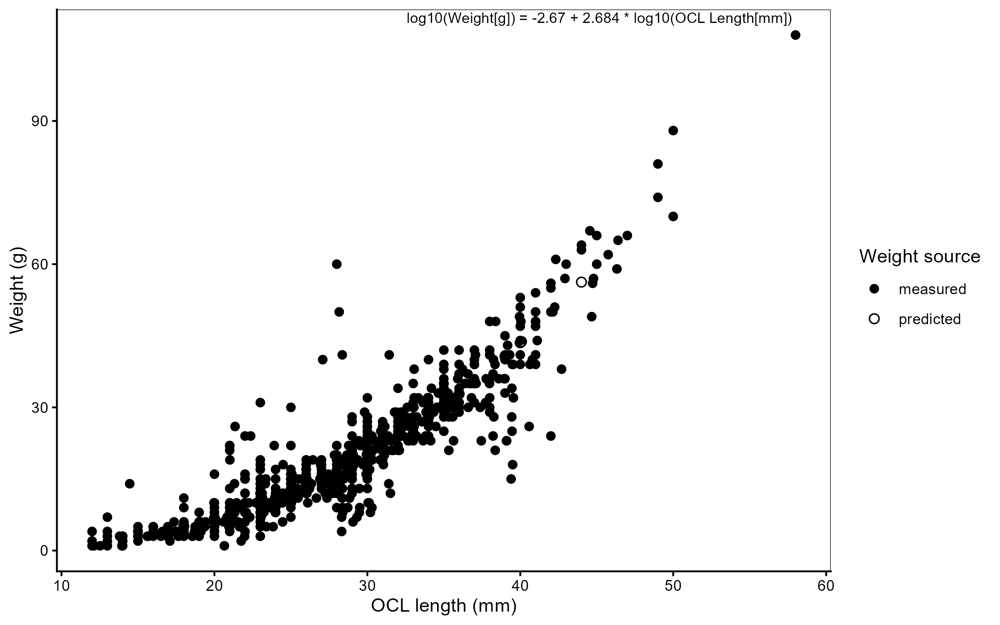

## Chapter 5 — Supplementary information {.unnumbered}

{#fig-length-weight-ch5 width=80%}

![Effect sizes (β ± 95% CI) for the key term of interest across all models (kōura and catfish; baseline, BACI, trajectory, and convergence comparisons). Filled points indicate significant effects (p < 0.05). Each panel has its own x-axis scale — β magnitudes are not directly comparable across panels because each comparison tests a different contrast (step-change, per-round slope, or simple group difference), and occupancy is on the log-odds scale while abundance and biomass models use the Tweedie log link. Models with degenerate confidence intervals (non-positive-definite Hessian) are excluded.](outputs/fig-forest-plot.png){#fig-forest-plot width=65%}

```{r}
#| label: tbl-models-summary-full-supp
#| echo: false
#| tbl-cap: "Full fixed-effect estimates (β, SE, 95% CI, p-value) for every term in every model."

tidy_all_full <- readr::read_csv(file.path("outputs", "tbl-models-summary-full.csv"), show_col_types = FALSE)
knitr::kable(tidy_all_full, digits = 3)
```

{#fig-convergence-plot width=80%}
